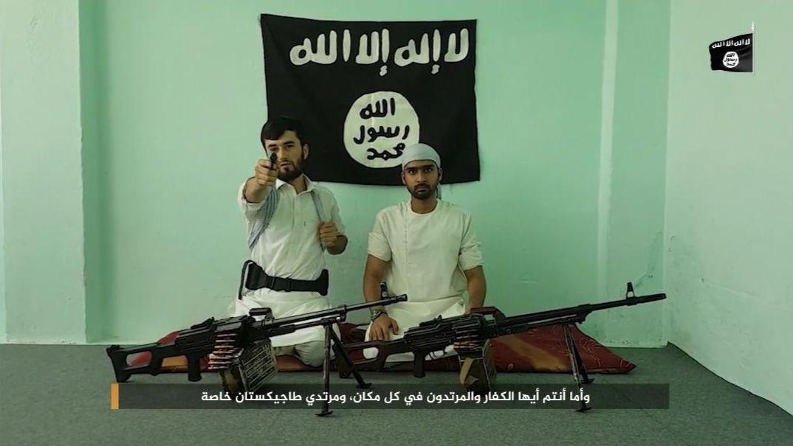

# taskworker-analyzeimage

## Installation

First download and install [Ollama](https://ollama.com/download).

For Linux:

```sh
curl -fsSL https://ollama.com/install.sh | sh
sudo useradd -r -s /bin/false -U -m -d /usr/share/ollama ollama
sudo usermod -a -G ollama $(whoami)
```

You need to edit the file `/etc/systemd/system/ollama.service` and add the line `Environment="CUDA_VISIBLE_DEVICES=0"`under the `Service` area to force Ollama to use a specific GPU.

Next tell Ollama to download the model to use, e.g. `llama3.2-vision`. This model is about 8 GB in size and requires about 8 GB of RAM or VRAM. See https://ollama.com/library for a list of available models.

```sh
ollama pull llama3.2-vision
```

Next download and install [Python 3.13](https://www.python.org/downloads/release/python-3130/). Open a shell in this repository and prepare a virtual environment in this way.

```sh
python3.13 -m venv venv
venv\Scripts\activate # Windows
source ./venv/bin/activate # Linux
pip install ollama requests
```

## Evaluations

Each evaluation was done with the following image and prompt.

```
Describe the following image as detailed and as exact as possible "./images/photo-is.jpg"
```



### llama3.2-vision (6.7GB RAM)

The image depicts two men sitting on a rug in front of a flag, with various weapons laid out before them. The scene appears      
to be set in a room with white walls.

* Two men:
        + Both are wearing white clothing
        + One is holding a gun and pointing it towards the camera
        + The other is looking directly at the camera with a neutral expression
* A flag:
        + Hanging on the wall behind the men
        + Features Arabic script in black and white
        + Appears to be a symbol of some sort, possibly a religious or political affiliation
* Guns:
        + Several rifles are laid out on the floor in front of the men
        + One man is holding a pistol and pointing it towards the camera

Overall, the image suggests that the two men are affiliated with a group or organization that values military preparedness       
and may have a strong ideological or religious component. The presence of the flag and guns creates an atmosphere of 
tension and potential conflict.

### llava (5.7GB RAM)

The image is a photograph showing two individuals in a room with a signboard of what appears to be an Islamic flag (in 
Arabic) in the background. The person on the left is holding up a camera, aiming it towards something off-camera, and 
appears to be pointing at the other individual. Both are wearing traditional Muslim attire—the man on the left wears a hat       
and a long white garment, while the person on the right is in a traditional outfit with a white turban.

In front of them, there are three assault rifles resting on their barrels, suggesting that the image might be related to
armed conflict or terrorism. The text overlaying the image indicates that it could be a screenshot from social media, given      
the low resolution and the presence of a user interface element, which includes a video play button (a triangle with a 
white arrow pointing rightwards) in the bottom center of the image.

The text itself is in Arabic, likely a caption or comment related to the content of the photograph. The overall style of         
the image suggests it might be used for propaganda purposes by a group associated with Islamic extremism, such as ISIS or a      
similar organization.

### llava:13b (10GB RAM)

The image appears to be a still from a video, given its low resolution and aspect ratio. There are two individuals seated       
on what looks like a bed or mattress. They are holding what appear to be toy guns, likely intended for children based on
their design. Behind them is a wall with a sign that reads "ALLAH" in Arabic script, indicating that the image may have 
been taken in an Islamic context. The person on the left seems to be pointing a finger at the camera or towards something        
out of frame, while the individual on the right is looking directly at the camera. There are text overlays in the image,         
but they are not readable due to the low resolution and angle at which the photo was taken.

### llava-llama3 (7.2GB RAM)

In the center of a white room, two men are seated on the floor. The man on the left is dressed in a white shirt and has his      
arm extended, pointing towards something out of frame. His companion on the right is also wearing a white shirt, but he has      
a blue bandana wrapped around his head. 

Behind them, against a green wall, hangs a black banner with Arabic text. The text translates to "Allahu Akbar" and "There       
is no god but Allah", which are common Muslim phrases. 

In front of the men, on the floor, are two guns. One gun has a red handle while the other has a black one. Their exact
positions or what they're aimed at cannot be determined from the image.

The room itself is quite minimalistic, with the green wall being the only notable feature apart from the banner and the 
men's presence. The overall atmosphere of the scene is solemn, perhaps indicative of a serious discussion or event taking        
place.

### bakllava (6.1GB RAM)

The image depicts two men sitting on a sheet, fully loaded with automatic rifles. They are accompanied by multiple guns
placed around them in the scene. One of the men is pointing to the camera as if showing off their weapons. The room appears      
to be a small, confined space where they are displaying their arsenal.

### llava-phi3 (5.4GB RAM)

In this image, two men are seated in front of a black backdrop with white Arabic text. The man on the left is pointing
towards his gun, which is placed behind him on a green carpeted floor. He is wearing a red headscarf and appears to be
speaking or gesturing as if addressing an audience. 

The man on the right is sitting next to the first man, also holding a gun that is positioned in front of them both. He too       
is dressed in a similar attire with a white cap and a white shirt adorned with red stripes. His attention seems to be
focused towards the other man or perhaps he is engaging with an unseen audience.

The text on the backdrop reads "من الجواب هي الحقيقة", which translates to "The truth is the answer". This phrase, combined      
with the men's attire and the presence of guns, suggests that this image might be related to a specific cultural or
religious context.

Please note that this description is based on the visible elements in the image and does not include any speculative or
interpretative details.